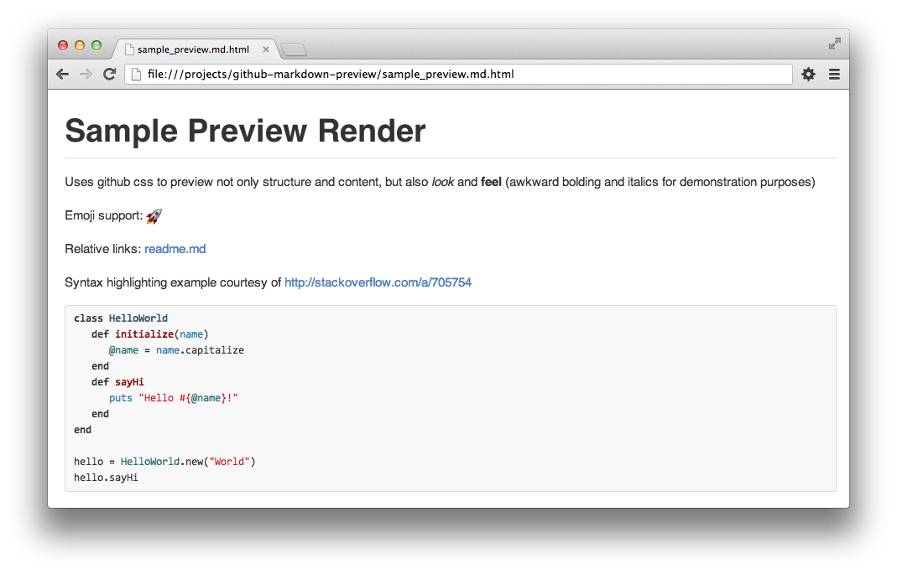

# Local Github Markdown Preview
[](https://travis-ci.org/dmarcotte/github-markdown-preview)

Use your favorite editor plus the usual edit/refresh cycle to quickly write and polish your markdown for Github.

This program marries [html-pipeline](https://github.com/jch/html-pipeline) with the [Listen file watcher](https://github.com/guard/listen) to provide a high-fidelity preview (in your local browser, automatically updating on edit) of how Github will render your markdown.



## Installation
```
gem install github-markdown-preview
```

## Usage

Generate a preview of how Github renders markdown files in a repository:

```bash
$ github-markdown-preview <path/to/markdown/file.md> # writes <path/to/markdown/file.md>
```

* The `.html` preview is written beside your `.md` file so that you can validate [relative links](https://github.com/blog/1395-relative-links-in-markup-files) locally
* The `.html` preview is deleted when the script exits

### Comment mode
Use the `-c` switch to generate a preview of how Github renders comments/issues, which differs from repository markdown files in a few ways:
* [newlines](https://help.github.com/articles/github-flavored-markdown#newlines) are rendered as hard breaks
* `@mentions` are linked to the user's home page
* [task lists](https://help.github.com/articles/github-flavored-markdown#task-lists) are rendered as checkboxes
* [TODO](https://github.com/dmarcotte/github-markdown-preview/issues/17): auto-linked [references](https://help.github.com/articles/github-flavored-markdown#references)

```bash
$ github-markdown-preview -c <path/to/comment/draft.md> # writes <path/to/comment/draft.md.html>
```

### Enable syntax highlighting for code blocks
To enable syntax highlighting for code blocks, you will need to install [`github-linguist`](https://github.com/github/linguist):
```
gem install github-linguist
```

Note that this install will fail unless your system meets the requirements needed to build its native extensions:
* You will to either `brew install icu4c` or `apt-get install libicu-dev`
* On Mac, you will need to have XCode installed (seems like a full install is required, not just the Command Line Tools)

## Code
Here's a sample file demonstrating how to call `github-markdown-preview` from your own code:
```ruby
require 'github-markdown-preview'

# create a preview, which writes the source_file.md.html file to disk
preview = GithubMarkdownPreview::HtmlPreview.new('source_file.md')

# you can also configure your preview with a couple of options
preview = GithubMarkdownPreview::HtmlPreview.new('source_file.md', {
    :delete_on_exit => true, # delete the preview when the program exits
    :comment_mode => true, # render using the rules for Github comments/issues
    :preview_file => 'custom_preview_file.html' # write preview to the given filename,
                                                # rather than the default 'source_file.md.html'
})

# access the preview information
preview.source_file # returns 'source_file.md'
preview.preview_file # returns 'source_file.md.html'

# explicitly update the preview file from the source
preview.update

# watch the source file and update the preview on change
preview.watch # non-blocking watch
preview.watch! # blocking watch

# add a callback to be fired on update; add multiple listeners by calling again
preview.update { puts 'Preview updated!' }

# stop watching the file (only applies to non-blocking watch method)
preview.end_watch

# delete the preview file from disk
preview.delete
```

## Development
```bash
$ bundle install
$ rake test
```

Alternatively, to test with optional dependencies
```bash
$ BUNDLE_GEMFILE=Gemfile.optional bundle install
$ BUNDLE_GEMFILE=Gemfile.optional rake test
```

To run your development copy of the main script without installing it
```bash
$ bundle exec bin/github-markdown-preview
```
To install the your development copy to your system
```bash
$ rake install
```

## Contributing

[Contributions](contributing.md) welcome!
